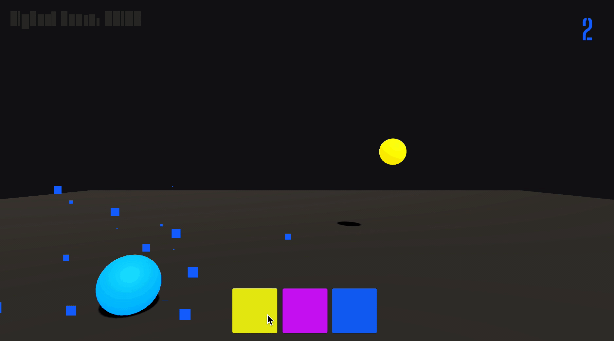

# ColorTyper
## Overview
ColorTyper is an open-source interview project I completed for a game studio. 
- In Color Typer, the player must select the color of the sphere that is shot towards them to gain points and stop the ball from hitting them (and losing).



## Project Specification
### Game Loop
- In Color Typer, the player must select the color of the sphere that is shot towards them to gain points and stop the ball from hitting them (and losing). 
- The possible colors are Red, Blue, Green, Yellow, and Purple. 
- In a JSON file, there should be ball data that can be serialized into a serializable ball class. 
- Each ball prefab that is instantiated from wherever the spawn point should be a certain color (material should be different) and move closer towards the camera/player. 
- If the ball hits the player or takes up the entirety of the camera, the game is over.
### UI Engineering
- UI should contain three rectangular buttons on the lower half of the screen that become a color. 
- Two of the colors should be random incorrect colors, and one color should be the correct one. 
- The player needs to click the matching color with the ball to gain points.
### Saving System
- Every ball that is successfully guessed should have its velocity increased by a small bit.
- The points should double every 6 colors guessed correctly. The score should be displayed using TextMesh Pro and a non-standard font (download a font and import it as TextMesh Pro (‘Font Asset Creator’)).
- The high score is saved (hint) and can be seen whenever the player plays the game again.

## Engineering
### 1. Ball Trajectory Calculation
I think the hardest part of this project is to calculate the directional vector to throw a ball from random locations to one point.
I had two approaches in mind: 
- 1) Calculate the actual ball trajectory angle, directional vector, height, and velocity.
- 2) Simulate the ball movement with smooth animation curve.
After some research and prototypting, I decided to go with approach 1) because the physics movement gives a more natural result compared with animation.
```
    //Reference: https://en.wikipedia.org/wiki/Trajectory
    private void BallTrajectory(Vector3 targetLocation)
    {
        float range = CalculateRange(Mathf.PI / 4);
        Vector3 startPos = CalculateStartPosition(range, Mathf.PI/4); //45 degree
        ball.transform.position = transform.position;
        ball.transform.eulerAngles = new Vector3(0f, 0f, 0f);
        ball.transform.position = startPos;
        ball.SetActive(true);
        Vector3 direction = (targetLocation - startPos).normalized;
        Vector3 elevation = CalculateAngleOfElevation(range, ballData.initialVelocity);
        float directionAngle = AngleBetweenAboutAxis(ball.transform.forward, direction, ball.transform.up);
        Vector3 velocity = Quaternion.AngleAxis(directionAngle, ball.transform.up) * elevation * ballData.initialVelocity;
        ballRd.velocity = Vector3.zero;
        ballRd.angularVelocity = Vector3.zero;
        ballRd.AddForce(velocity, ForceMode.VelocityChange);
    }
```

### 2. Performance Optimization
- Given the game loop, the player can only see a maximum of two balls on screen.
- Therefore, I used only one ball with collider throughout the entire game because instantiating one ball per second is very expensive and not efficient. 
- Another ball mesh is reused as a death animation that only instantiate once when game started.

### 3. Serialization
- Implemented json saving system to save player data.
- Implemented a script to read in ball data stored in a json file at the start of the game.

# Playable Build
[Executable](https://drive.google.com/drive/folders/1Ro2Bw0EAKtR_sZGa7V5z0GG9BkU_XaHO?usp=sharing)
